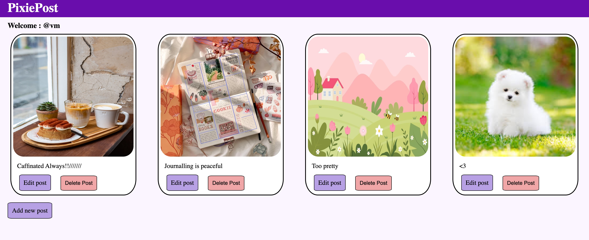
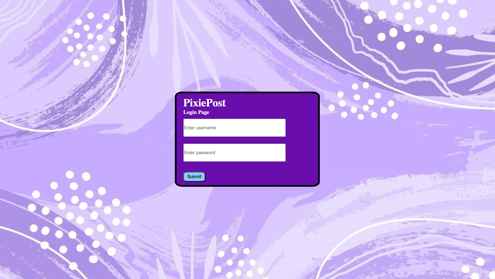

<h1>🌸 PixiePost</h1>

  <strong>PixiePost</strong> is a simple and aesthetic beginner-friendly web app where users can:

<ul>
  <li>Log in via a UI-only form (no authentication)</li>
  <li>Add posts with images and captions</li>
  <li>Edit or delete existing posts</li>
</ul>

<em>All data is stored in-memory and resets on server restart</em>

<h2>✨ Features</h2>
<ul>
  <li>Add new posts with an image and caption</li>
  <li>Edit or delete posts</li>
  <li>Clean UI using EJS templating</li>
  <li>Responsive design</li>
</ul>

<h2>🛠 Tech Stack</h2>
<ul>
  <li><strong>Frontend:</strong> HTML, CSS, EJS</li>
  <li><strong>Backend:</strong> Node.js, Express.js</li>
  <li><strong>Templating:</strong> EJS</li>
</ul>

<h2>🚀 How to Run Locally</h2>
<pre><code>
# Clone the repository
git clone https://github.com/VM11-hash/pixiepost.git

# Move into project directory
cd pixiepost

# Install dependencies
npm install

# Start the server
nodemon index.js

# Open in browser
http://localhost:8000
</code></pre>

<h2>📝 Note</h2>
<ul>
  <li>No database or authentication — purely a learning project</li>
  <li>All post data is lost when the server restarts</li>
</ul>

<h2>📸 Preview</h2>

  
  

<h2>👩‍💻 Author</h2>

<strong>Vartika Malik</strong> 
<a href="https://www.linkedin.com/in/vartika-malik-817281345/">LinkedIn</a>

